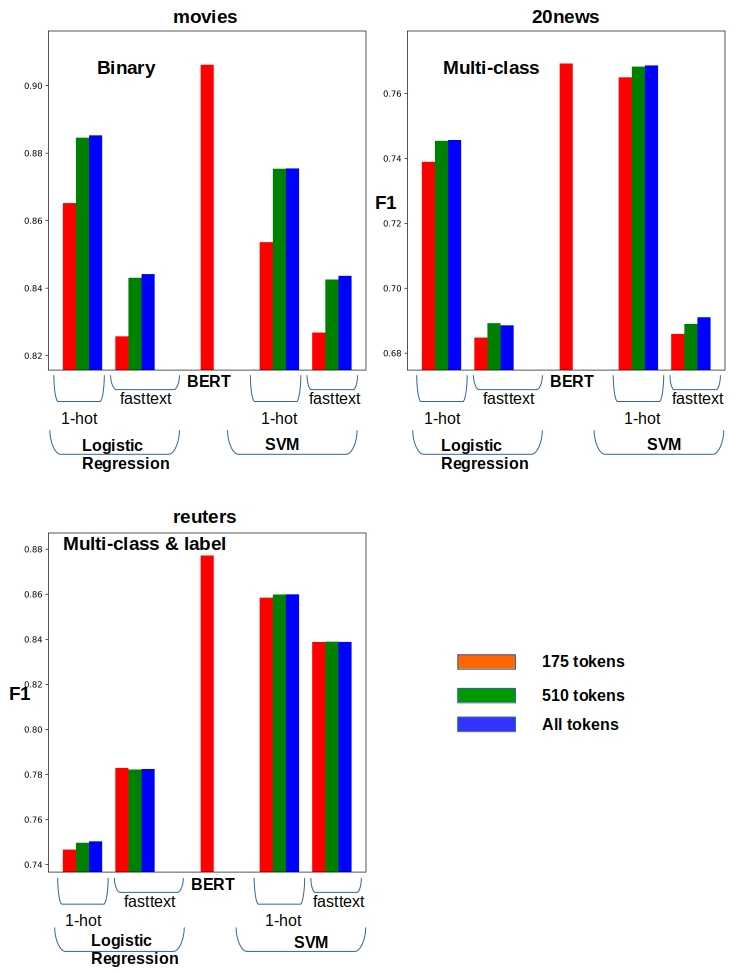
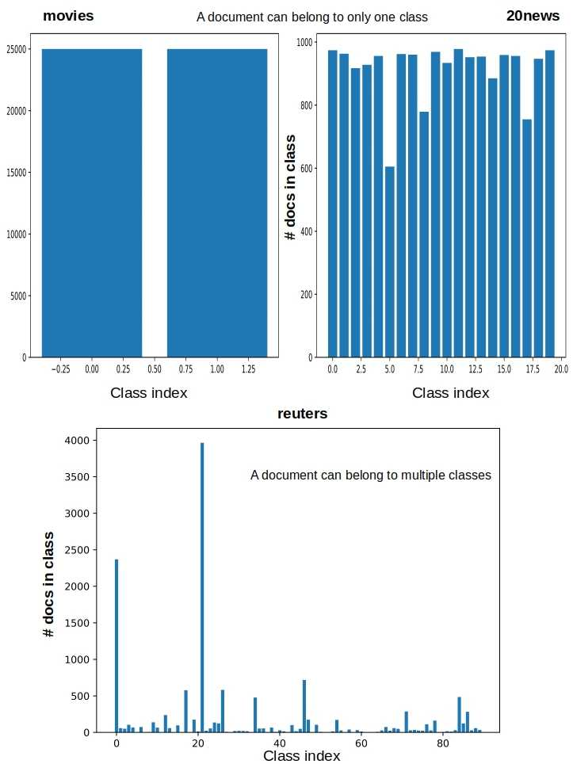
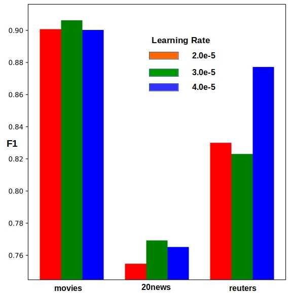

# BoW Vs BERT: Classification
Comparing SVM on top of bag-of-words approach to BERT for text classification

This is the source code to go along with the blog article

[BoW vs BERT: Classification](http://xplordat.com/2019/10/10/bow-vs-bert-classification/)

*Figure 6. BERT is the leader of the pack in all cases, even if not by much in some cases.*

##  Summary

BERT yields the best F1 scores on three different repositories representing binary, multi-class, and multi-label/class situations. BoW with tf-idf weighted one-hot word vectors using SVM for classification is not a bad alternative to going full bore with BERT however, as it is cheap.

##	Dependencies
	transformers
	tensorflow
	numpy

## To reproduce the resuts in the post

Download: [BERT-Base, Uncased](https://storage.googleapis.com/bert_models/2018_10_18/uncased_L-12_H-768_A-12.zip). Edit the script "runBert.sh" so it can find it

	BERT_BASE_DIR="$PRE_TRAINED_HOME/bert/uncased_L-12_H-768_A-12"

Download: [crawl-300d-2M-subword.vec](https://dl.fbaipublicfiles.com/fasttext/vectors-english/crawl-300d-2M-subword.zip). Edit the script "bow_classify.py" so it can find it

	f = open(os.environ["PRE_TRAINED_HOME"] + '/fasttext/crawl-300d-2M-subword.vec')

### To reproduce the results

#### Prepare the data: 

	cd data

	tar zxvf aclImdb.tar.gz 

	cd ..

	pipenv run python ./getdata.py

#### You should be able to get images in here:

*Figure 2. The vitals of the document repositories. All documents are used for classification but the longer ones are truncated to the first X number of words. Logistic regression and SVM can handle all the words, but we need make sure to use identically processed docs for head-2-head comparisons between BERT and non-BERT counterparts.*

*Figure 3. Class distribution. The reuters data set is skewed with as few as 2 documents for some classes and 4000 for another. The other two data sets are quite balanced.*

#### Prepare for the runs:

	mkdir results

### Run BoW

	./runBoW.sh

### Run BERT (may take a while & will need good bit of resources)

	./runBert.sh

### Change the learning rate in "tf2_bert_classify.py"

		   >> model.compile(optimizer=tf.optimizers.Adam(learning_rate=2e-5, epsilon=1e-08, clipnorm=1.0), loss=tfLoss, metrics=allMetrics)

#### and rerun "./runBert.sh" to reproduce results like:

*Figure 7. Learning rate has to be small enough for BERT to be fine tuned. Some improvement in F1 can be obtained by playing with learning rate a bit.*
